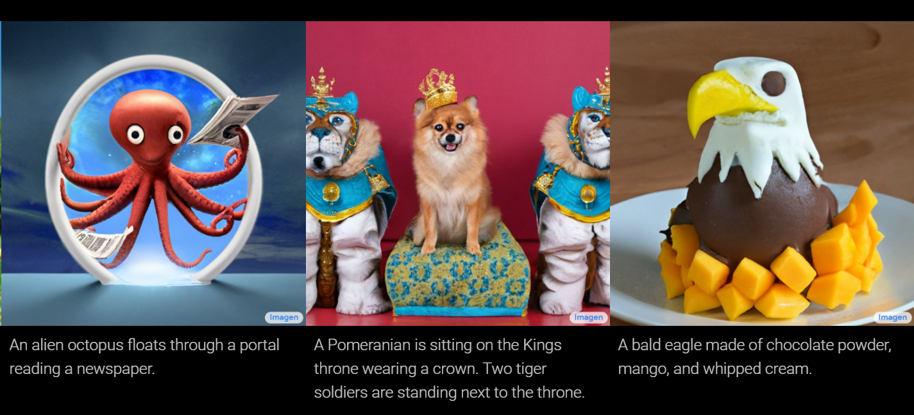
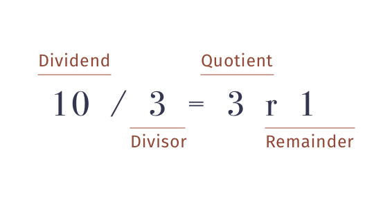
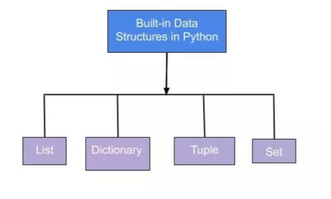
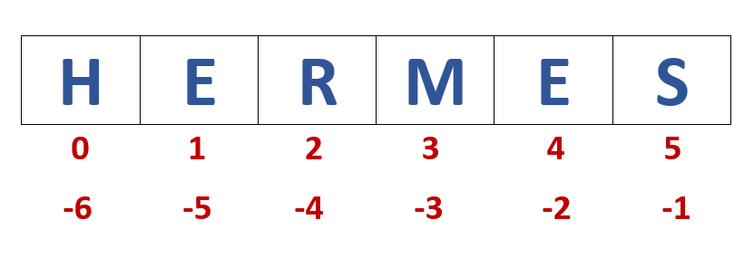
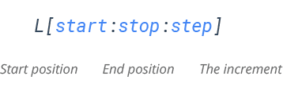
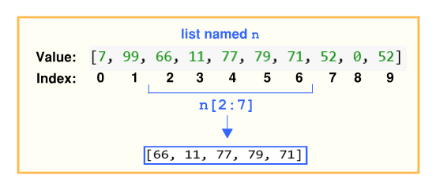
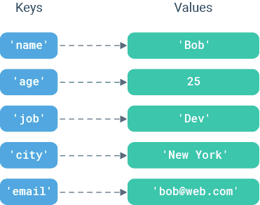
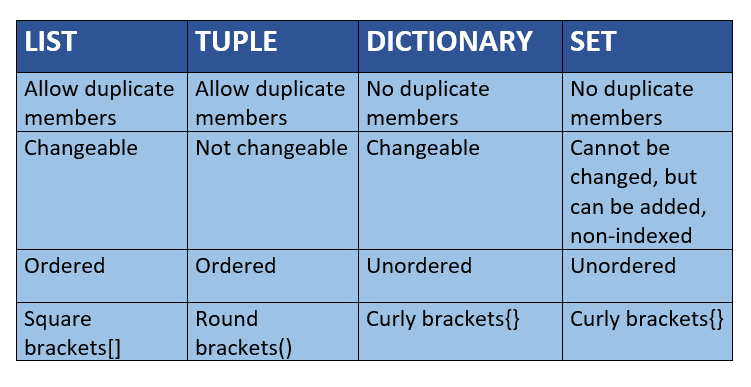
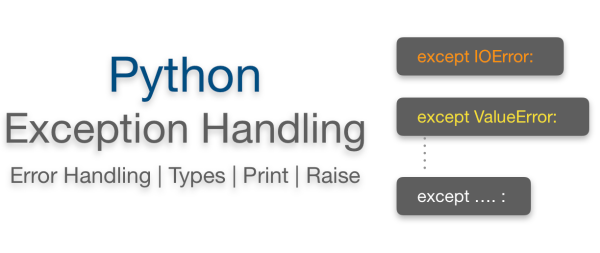

# Introduction-to-machine-learning-Session1-2

**📑 Table of Content :
Python Basic-Day-01**
* [Introduction of python](#intro)
* [Mindblowing applications of AI](#app)  
* Implementation of python(Part-01)
  * [print and input function](#print)  
  * [Variables and Maths Operations](#variables) 
  * [List](#list)  
  * [Sets](#set)  
  * [Casting](#cast)  
  * [Dictionaries](#dict)  
  * [Tuples](#tuple)  
  * [String](#string)  
  
  
* Implementation of python(Part-02)  
    * [Conditional execution](#conditional)
    * [For-loops](#loop)
    * [List Comprehensions](#list_comprehension)
    * [Functions](#func)  
    * [Lambda expressions](#lambda)    
    * [Errors and Exceptions Handling](#error)  
    
    The Zen of Python, by Tim Peters

Beautiful is better than ugly.
Explicit is better than implicit.
Simple is better than complex.
Complex is better than complicated.
Flat is better than nested.
Sparse is better than dense.
Readability counts.
Special cases aren't special enough to break the rules.
Although practicality beats purity.
Errors should never pass silently.
Unless explicitly silenced.
In the face of ambiguity, refuse the temptation to guess.
There should be one-- and preferably only one --obvious way to do it.
Although that way may not be obvious at first unless you're Dutch.
Now is better than never.
Although never is often better than *right* now.
If the implementation is hard to explain, it's a bad idea.
If the implementation is easy to explain, it may be a good idea.
Namespaces are one honking great idea -- let's do more of those!

# <a id ="app">Mindblowing applications of AI</a>
* **GAN** : Generator of fake faces of non-existent humans  
https://this-person-does-not-exist.com/en  

* **GPT-3**: Generative Pre-trained Transformer 3 is an autoregressive language model that uses deep learning to produce human-like text.  
https://www.youtube.com/watch?v=jz78fSnBG0s  

* **AIVA**: he Artificial Intelligence composing emotional soundtrack music  
https://www.youtube.com/watch?v=Emidxpkyk6o   
TRY IT YOURSELF: https://creators.aiva.ai/

* **DALL·E 2**: is a new AI system that can create realistic images and art from a description in natural language.  
https://www.youtube.com/watch?v=qTgPSKKjfVg 

* **OpenAI Codex**: OpenAI Codex is an artificial intelligence model developed by OpenAI. It parses natural language and generates code in response. It is used to power GitHub Copilot, a programming autocompletion tool developed for Visual Studio Code.  
https://www.youtube.com/watch?v=cLQc-5BJz4g

* **Google’s Imagen AI** :Imagen is an AI system that creates photorealistic images from input text
  
  
    
    
TRY IT YOURSELF : 
https://colab.research.google.com/drive/1n_xrgKDlGQcCF6O-eL3NOd_x4NSqAUjK#scrollTo=TnMw4FrN6JeB

* **OpenAI Five** Beats World Champion DOTA2 Team 2-0: OpenAI Five is a computer program by OpenAI that plays the five-on-five video game Dota 2.  

* **Quick, Draw!** :The game challenges you to draw an object within a time limit while it attempts to guess what your doodle is.  
TRY IT YOUSELf: https://quickdraw.withgoogle.com/  
* **Talk to Books**: This AI experiment was developed and trained using almost a billion lines of dialogues so it can adequately respond to any question that’s input to it. It scans over 100,000 books in response to any question, and attempts to find an answer from them.  
TRY IT YOURSELF: https://books.google.com/talktobooks/

## <a id="print">Print</a>
The `print()` function allows you to send output to the terminal  
>**❗ NOTE:**
Please take care to note that "print" is all lower-case (Python is case-sensitive). And don't forget the curly brackets! "()"

## Math Operators
From **Highest** to **Lowest** precedence:

| Operators | Operation        | Example         |
| --------- | ---------------- | --------------- |
| **        | Exponent         | `2 ** 3 = 8`    |
| %         | Modulus/Remaider | `10 % 3 = 1`    |
| //        | Integer division | `10 // 3 = 3`   |
| /         | Division         | `22 / 8 = 2.75` |
| *         | Multiplication   | `3 * 3 = 9`     |
| -         | Subtraction      | `5 - 2 = 3`     |
| +         | Addition         | `2 + 2 = 4`     |

## <a id="variables">Variables</a>
We can give a name to a value using variable.

## Booleans
Boolean values represent truth or falsehood.

 

    <b>Syntax</b>
     
    <ul>
        <li>To assign a variable with a specific value, use `=`</li>
        <li>To test whether a variable has a specific value, use the boolean operators:</li>
        <ul>
            <li>equal: `==`</li>
            <li>not equal: `!=`</li>
            <li>greater-than: `>`</li>
            <li>less-than: `<`</li>
        </ul>
        <li>You can also add helpful comments to your code with the `#` symbol. Any line starting with a `#` is not executed. I find it very useful to make detailed notes about my thinking since, often, when you come back to code later you can't remember why you did what you did, or what your code is even supposed to do.</li>
    </ul>

## Integers
Integers represent whole numbers.

## Floating point numbers
Floating point numbers, often simply referred to as floats, are numbers expressed in the decimal system, i.e. 2.1, 999.998, -0.000004 etc. 

The value 2.0 would also be interpreted as a floating point number, but the value 2, without the decimal point will not; it will be interpreted as an integer.
## The None object
The None object is special built-in value which can be thought of as **representing nothingness or that something is undefined.**

# data structures in python
The general idea is that you can place several items into a single collection and then refer to that collection as a whole. Which one you will use will depend on what problem you are trying to solve.  

## <a id="list">Lists</a>
* Can contain any number of items
* Can contain different types of items
* Can be altered once created (they are mutable)
Items have a particular order

### Indexing
You can access individual elements of the collection using their index, note that the first element is at index 0. Negative indices count backwards from the end.

### len() function
You can get the length of a list with the in-built `len()` function.

### count() function
you can count the number of particular elements contained in a list with the `count()` function.

### Slices
You can also access a range of items, known as slices, from inside lists and tuples using a colon : to indicate the beginning and end of the slice inside the square brackets.  
>**❗ Note that the slice notation [a:b] includes positions from a up to but not including b.**

 

### Reversing lists
This can be done either by step in slicing or buit in List funciton:

### in operator
You can check if a value is in a list with the in operator, and you can negate this with not

### List modification
You can alter lists in place.

### Adding item in list
You can add elements to the end of a list with `append()`

or insert values at a certain position with `insert()`

### append and extend

## <a id="set">Sets</a>
* Sets contain unique elements, i.e. no repeats are allowed
* The elements in a set do not have an order
* Sets cannot contain elements which can be internally modified (e.g. lists and dictionaries)
* Use sets to extract unique data from lists.

**Symmetric Difference** of A and B is a set of elements in both A and B except those that are common in both.Symmetric difference is performed using ^ operator. Same can be accomplished using the method symmetric_difference()

### <a id="cast">Converting Types with the list and set Functions</a>

* As we mentioned it before, we can use set to extract unique data from lists.
This can be done by casting.

## <a id="dict">Dictionaries</a>
Dictionaries are key/value pairs of a collection of items. Unlike a list where items can only be accessed by their index or value, dictionaries use keys to identify each item.

* Contain a mapping of keys to values (like a word and its corresponding definition in a dictionary)
* The keys of a dictionary are unique, i.e. they cannot repeat
* The values of a dictionary can be of any data type
* The keys of a dictionary cannot be an internally modifiable type (e.g. lists, but you can use tuples)
* Dictionaries do not store data in any particular order

You can access values safely with the `get()` method, which gives back None if the key is absent and you can also supply a default values

## <a id="tuple">Tuples</a>

* Can contain any number of items
* Can contain different types of items
* **Cannot** be altered once created (they are immutable)
* Items have a defined order

### Immutability
It can't be stressed enough that tuples are immutable. To drive that point home:

## Conclusion

### String formatting
Python 3 introduced a new way to do string formatting that was later back-ported to Python 2.7. This makes the syntax for string formatting more regular.

## <a id="conditional">Conditional execution</a>
### What is an if statement?
A conditional if statement is used to specify that some block of code should only be executed if some associated test is upheld.

### Comparison Operators  

| Operator | Meaning                  |
| -------- | ------------------------ |
| `==`     | Equal to                 |
| `!=`     | Not equal to             |
| `<`      | Less than                |
| `>`      | Greater Than             |
| `<=`     | Less than or Equal to    |
| `>=`     | Greater than or Equal to |

These operators evaluate to True or False depending on the values you give them.

### and, or, not
Well say for instance you want to write some code that returns a number that is divisible by 5 **OR** divisible by 10. Maybe you want to write some code that checks if a number is odd **AND** also a perfect square

## <a id="loop">For-loops</a>
A `for` loop is used for iterating over a sequence (that is either a list, a tuple, a dictionary, a set, or a string).
### Loop with range function

- It generates arithmetic progressions
- It is possible to let the range start at another number, or to specify a different increment.
- Since Python 3, the object returned by `range()` doesn’t return a list to save memory space. `xrange` no longer exists.
- Use function list() to creates it.

### The `while` loop
`while` execute while a particular condition is `True`.

### Skipping and breaking loops

* **break** Statements: If the execution reaches a break statement, it immediately exits the while loop’s clause.
* **continue** Statements: When the program execution reaches a continue statement, the program execution immediately jumps back to the start of the loop.

## <a id="list_comprehension">List Comprehensions</a>
Python makes it simple to generate a required list with a single line of code using list comprehensions.

## <a id="func">Functions</a>
Functions allow you to take code that is repeated and move it to a module that can be called when needed. Functions are defined with the `def` keyword and must be declared before the function is called in your code. Functions can accept parameters and return values.

### Default arguments
Sometimes it is useful to give some arguments a default value that the caller can override, but which will be used if the caller does not supply a value for this argument. We can do this by assigning some value to the named argument with the `=` 
operator in the function definition.

## <a id="error">Errors and Exceptions Handling</a>

> Errors should never pass silently. Unless explicitly silenced. ~ Zen of Python  

The basic terminology and syntax used to handle errors in Python is the `try` and `except` statements.
 

### finally
The `finally` block of code will always be run regardless if there was an exception in the try code block

## 🎉 Congratulation! You reached the end of the python notebook!
